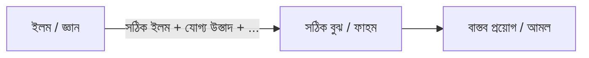

# লেকচার – ১: ইসলামী জ্ঞানসমূহ ও তার শাখা-প্রশাখা (বিস্তারিত)

ইসলামী জ্ঞান বলতে কুরআন ও সুন্নাহভিত্তিক সেই সমুদয় জ্ঞানকে বোঝায়, যা মানবজাতিকে ইহকালীন কল্যাণ ও পরকালীন মুক্তির পথ দেখায়। এর মূল লক্ষ্য হলো মানুষকে সঠিক আকিদা (বিশ্বাস), শুদ্ধ আমল (কাজ) ও উত্তম চরিত্রে পৌঁছানো।

---

## কোনো বিষয় গভীরভাবে শেখার ধাপ (Steps of Success)

ইসলামী জ্ঞানার্জনের ক্ষেত্রে গভীরতা অর্জনের জন্য কিছু নির্দিষ্ট ধাপ অনুসরণ করা প্রয়োজন। এই ধাপগুলো একটি ধারাবাহিক প্রক্রিয়ার অংশ, যা একজন শিক্ষার্থীকে জ্ঞানের সর্বোচ্চ শিখরে পৌঁছাতে সাহায্য করে।

---

## ধাপগুলোর বিস্তারিত ব্যাখ্যা

### ১. ইলম (العلم – জ্ঞান)

ইলম শুধু কিছু তথ্য মুখস্থ করার নাম নয়। এটি একটি ব্যাপক ধারণা, যা নির্ভরযোগ্য উৎস থেকে অর্জিত হতে হয়।

* ইসলামী জ্ঞানের প্রধান উৎস হলো কুরআন ও সুন্নাহ
* নির্ভরযোগ্য আলেমদের ব্যাখ্যা ও বিশ্লেষণ থেকে জ্ঞান গ্রহণ করা জরুরি
* ভুল উৎস থেকে অর্জিত জ্ঞান বিভ্রান্তির কারণ হতে পারে

### ২. সঠিক বুঝ (الفهم – ফাহম)

ফাহম হলো অর্জিত জ্ঞানকে সঠিকভাবে উপলব্ধি করা এবং এর অন্তর্নিহিত অর্থ বোঝা।

* অনেক তথ্য জানা থাকলেও সঠিক ব্যাখ্যা না বুঝলে তা বিপদের কারণ হতে পারে
* গভীর মনোযোগ, চিন্তা ও বিশ্লেষণের মাধ্যমে ফাহম আসে

### ৩. বাস্তব প্রয়োগ (العمل – আমল)

ইসলামে জ্ঞানের চূড়ান্ত লক্ষ্য হলো আমল।

* আমলবিহীন জ্ঞান ফলহীন গাছের মতো
* জ্ঞানকে জীবনে বাস্তবায়ন করাই প্রকৃত সফলতা

---

## সঠিক বুঝ (ফাহম) কীভাবে আসে?

সঠিক ফাহম অর্জনের জন্য প্রয়োজন—

* সঠিক ইলম (কুরআন ও সুন্নাহ)
* যোগ্য উস্তাদ
* নিজের মেধা ও পরিশ্রম
* ইখলাস (নিয়তের বিশুদ্ধতা)
* দু’আ
* ধারাবাহিকতা (তাদাররুজ)

**সমীকরণ:**

সঠিক ইলম + যোগ্য উস্তাদ + পরিশ্রম + ইখলাস + দু’আ + ধারাবাহিকতা = সঠিক ফাহম

এগুলোর কোনো একটি বাদ পড়লে বুঝ অসম্পূর্ণ থেকে যায়।

---

## সালাফদের বক্তব্য

ইয়াহইয়া ইবনু আবি কাসীর (রহ.) বলেন:

> لاَ يُسْتَطَاعُ الْعِلْمُ بِرَاحَةِ الْجِسْمِ

**ভাবার্থ:**

শারীরিক আরামের মাধ্যমে জ্ঞান অর্জন সম্ভব নয়। জ্ঞানার্জনে কষ্ট ও ত্যাগ অপরিহার্য।

---

## ইলম ও আমলের মধ্যে সেতু – সিরাতুল মুস্তাকীম

ইলম ও আমলের মাঝে সংযোগ স্থাপন করতে হলে প্রয়োজন—

* সঠিক ফাহম
* অনুকূল পরিবেশ
* নফস ও শয়তানের বিরোধিতা (মুজাহাদা)
* সৎ লোকদের সাহচর্য (সুহবত)

---

## ইসলামী জ্ঞানের প্রধান শাখাসমূহ

### ১. ইমানিয়াত (الإيمانيات)

* তাওহিদ
* ফেরেশতা, কিতাব, রাসূল
* আখিরাত
* তাকদির (ভাল-মন্দ)

### ২. ইবাদাত (العبادات)

* সালাত
* সিয়াম
* যাকাত
* হজ

### ৩. মুয়ামালাত (المعاملات)

* ব্যবসা-বাণিজ্য
* চুক্তি
* ঋণ
* উত্তরাধিকার
* ইসলামী অর্থনীতি

### ৪. মুয়াশারাত (المعاشرات)

* পারিবারিক জীবন
* সামাজিক আচরণ
* প্রতিবেশীর হক

### ৫. আখলাক (الأخلاق)

* উত্তম চরিত্র: সততা, ধৈর্য, নম্রতা, দয়া
* বর্জনীয় চরিত্র: অহংকার, হিংসা, গীবত, মিথ্যা

---

## ইসলামী জ্ঞানের উৎস

১. **কুরআন (القرآن)** – আল্লাহর বাণী
2. **হাদিস (الحديث)** – নবী (সা.)-এর কথা, কাজ ও অনুমোদন
3. **ইজমা (الإجماع)** – উলামাদের ঐক্যমত
4. **কিয়াস (القياس)** – শরিয়াহভিত্তিক যুক্তি

---

## ব্যবহারিক জ্ঞান = ফিকহ (الفقه)

ফিকহ মানে হলো—দৈনন্দিন জীবনে শরিয়াহ কীভাবে প্রয়োগ করতে হবে তার জ্ঞান।

---

## ফিকহ শেখার ধাপসমূহ

### ১. আল-ফিকহুল মুজাররাদ (الفقه المجرد)

* ফিকহের প্রাথমিক স্তর
* মাসআলার সাধারণ পরিচয়
* দলিল বা গভীর ব্যাখ্যা নেই

### ২. আল-ফিকহুল মুতাল্লাল (الفقه المعلل)

* মাসআলার দলিলসহ ব্যাখ্যা
* কুরআন ও হাদিসভিত্তিক বিশ্লেষণ

### ৩. আল-ফিকহুল মুকারান (الفقه المقارن)

* বিভিন্ন মাজহাবের তুলনামূলক আলোচনা
* মতপার্থক্যের কারণ বিশ্লেষণ
* শক্তিশালী মত নির্ণয়ের চেষ্টা

# লেকচার – ২: দারসুল হাদীস (০১)

## ইসলাম, ঈমান ও ইহসান – হাদীসে জিবরাইল (আঃ)

এই লেকচারে আমরা ইসলামের তিনটি মূল স্তম্ভ— **ইসলাম, ঈমান ও ইহসান**—সম্পর্কে আলোচনা করব। এই তিনটি বিষয় একত্রে স্পষ্টভাবে এসেছে বিখ্যাত **হাদীসে জিবরাইল**-এ, যা দ্বীনের একটি পূর্ণাঙ্গ কাঠামো উপস্থাপন করে।

---

## আমলের ভিত্তি: নিয়ত (النية)

ইসলামে কোনো আমল গ্রহণযোগ্য হওয়ার মূল ভিত্তি হলো **নিয়ত**। বাহ্যিকভাবে বড় আমল হলেও, যদি নিয়ত সঠিক না হয়, তবে তা আল্লাহর কাছে গ্রহণযোগ্য হয় না।

"নিশ্চয়ই সকল আমল নিয়তের ওপর নির্ভরশীল। আর প্রত্যেক ব্যক্তি তাই পাবে, যা সে নিয়ত করেছে।"

**সহিহ বুখারি**, হাদীস: ১
**সহিহ মুসলিম**, হাদীস: ১৯০৭

**আমাদের একমাত্র নিয়ত হবে—আল্লাহকে সন্তুষ্ট করা।**

---

## কিতাবুল ঈমান (كتاب الإيمان)

হাদীসের কিতাবসমূহে যে অধ্যায়ে ঈমানসংক্রান্ত আলোচনা করা হয়, তাকে বলা হয় **কিতাবুল ঈমান**। হাদীসে জিবরাইল এই অধ্যায়ের অন্যতম ভিত্তিমূলক হাদীস।

---

## হাদীসে জিবরাইল (حديث جبريل)

### বর্ণনাকারী

**হযরত উমর ইবনুল খাত্তাব (রাঃ)**

### হাদীসের মূল বর্ণনা

হযরত উমর (রাঃ) বলেন—

একদিন আমরা রাসূলুল্লাহ ﷺ–এর মজলিসে বসে ছিলাম। হঠাৎ আমাদের সামনে একজন ব্যক্তি উপস্থিত হলেন। তাঁর কাপড় ছিল ধবধবে সাদা, চুল ছিল কুচকুচে কালো। তাঁর মধ্যে সফরের কোনো চিহ্ন দেখা যাচ্ছিল না, অথচ আমাদের মধ্যে কেউই তাঁকে চিনত না।

তিনি এসে রাসূল ﷺ–এর কাছে বসে পড়লেন। নিজের হাঁটু তাঁর হাঁটুর সঙ্গে লাগালেন এবং হাত রাখলেন নিজের উরুর ওপর। এরপর তিনি জিজ্ঞেস করলেন—

### ১. ইসলাম সম্পর্কে প্রশ্ন

“হে মুহাম্মাদ, আমাকে ইসলাম সম্পর্কে বলুন।”

রাসূলুল্লাহ ﷺ বললেন—

"ইসলাম হলো— তুমি সাক্ষ্য দেবে যে আল্লাহ ছাড়া কোনো ইলাহ নেই এবং মুহাম্মাদ ﷺ আল্লাহর রাসূল। তুমি সালাত কায়েম করবে, যাকাত আদায় করবে, রমজানে রোজা রাখবে এবং যদি সামর্থ্য থাকে তবে বাইতুল্লাহর হজ আদায় করবে।"

লোকটি বলল—

**«صَدَقْتَ»** (আপনি সত্য বলেছেন)।

হযরত উমর (রাঃ) বলেন— লোকটি প্রশ্ন করে আবার উত্তরের সত্যায়ন করায় আমরা বিস্মিত হয়ে গেলাম।

---

### ২. ঈমান সম্পর্কে প্রশ্ন

রাসূল ﷺ বললেন—

"ঈমান হলো— আল্লাহ, তাঁর ফেরেশতাগণ, তাঁর কিতাবসমূহ, তাঁর রাসূলগণ, আখিরাতের দিন এবং তাকদিরের ভালো-মন্দ সব কিছুর ওপর বিশ্বাস করা।"

লোকটি আবার বলল— **«صَدَقْتَ»**

---

### ৩. ইহসান সম্পর্কে প্রশ্ন

"ইহসান হলো— তুমি এমনভাবে আল্লাহর ইবাদত করবে যেন তুমি তাঁকে দেখছ। যদি তুমি তাঁকে দেখতে না পাও, তবে জেনে রাখো— তিনি তোমাকে দেখছেন।"

---

### কিয়ামত সম্পর্কে প্রশ্ন

লোকটি কিয়ামত সম্পর্কে জিজ্ঞেস করলে রাসূল ﷺ বলেন—

"এ বিষয়ে প্রশ্নকারী ও যাকে প্রশ্ন করা হয়েছে— কেউই অধিক জানে না।"

---

লোকটি চলে যাওয়ার পর রাসূল ﷺ বলেন—

"তিনি ছিলেন জিবরাইল (আঃ)। তিনি তোমাদের দ্বীন শিক্ষা দিতে এসেছিলেন।"

**সহিহ মুসলিম**, হাদীস: ৮

---

## হাদীসে জিবরাইল থেকে প্রাপ্ত মূল শিক্ষা

* দ্বীনের পূর্ণ কাঠামো = ইসলাম + ঈমান + ইহসান
* বাহ্যিক আমল (ইসলাম) ও অন্তরের বিশ্বাস (ঈমান)—উভয়ই জরুরি
* ইহসান হলো দ্বীনের সর্বোচ্চ স্তর
* নিয়ত ছাড়া কোনো আমল গ্রহণযোগ্য নয়

---

## Summary

| স্তর  | বিষয়                           |
| ----- | ------------------------------ |
| ইসলাম | বাহ্যিক আমল                    |
| ঈমান  | অন্তরের বিশ্বাস                |
| ইহসান | আল্লাহকে দেখার অনুভূতিতে ইবাদত |
